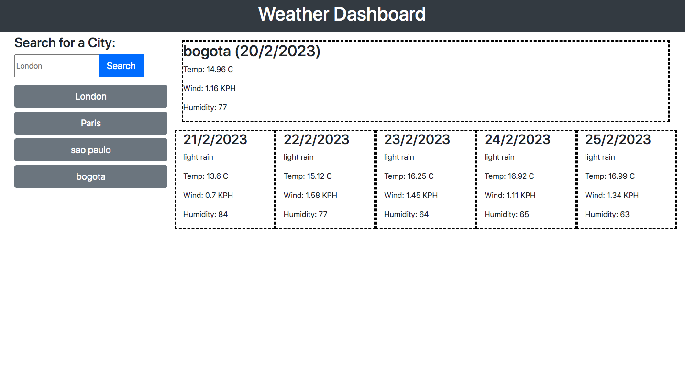

# weather-dashboard

#Description

This weeks challenge was to create a weather dashboard that can display the current weather and the the 5 day forecast for any city using the open weather API. The user story is AS A traveler I WANT to see the weather outlook for multiple cities SO THAT I can plan a trip accordingly. The acceptance criteria for the challnge was to:

Create a weather dashboard with form inputs.

When a user searches for a city they are presented with current and future conditions for that city and that city is added to the search history.

When a user views the current weather conditions for that city they are presented with:

The city name

The date

An icon representation of weather conditions

The temperature

The humidity

The wind speed

When a user views future weather conditions for that city they are presented with a 5-day forecast that displays:

The date

An icon representation of weather conditions

The temperature

The humidity

When a user clicks on a city in the search history they are again presented with current and future conditions for that city.

#Usage

The page has a form input where you can search for any city. Once a city is typed and the user clicks search, the current forecast is displayed at the top of the page, along with the 5 day forecast. The user city input is saved underneath the form as a button, and when clicked, the forecast can be displayed on the dashboard again without the user re-typing the city. 

Here is an image of the page:

Here is a link to the GitHub repository: https://github.com/shazzy-kawa/weather-dashboard.git
Here is a link to the deployed page: https://shazzy-kawa.github.io/weather-dashboard/ 

#license
Created using an MIT license